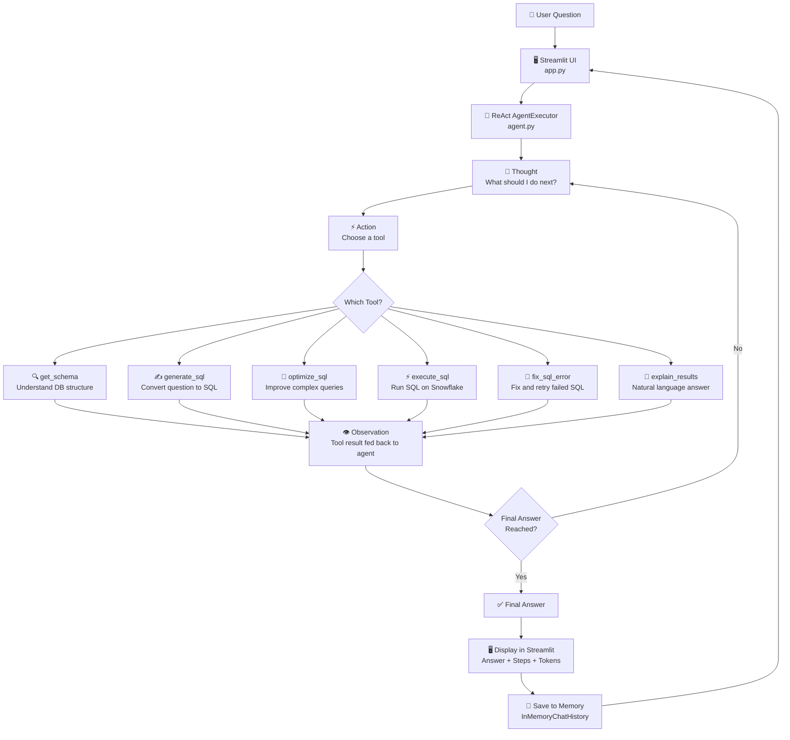
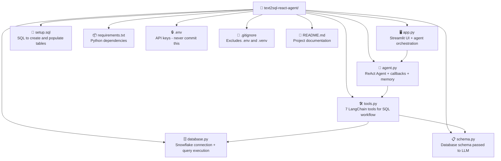
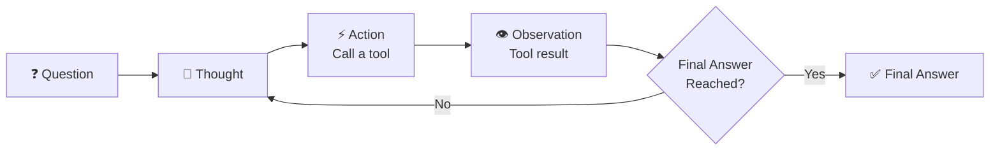

# 🤖 Text2SQL Agentic AI

An intelligent ReAct Agent that autonomously reasons, writes SQL, validates,
executes, and explains results from your Snowflake database in plain English
— powered by Groq LLaMA 3.3 + LangChain ReAct Agent + Streamlit.


## 🌐 Live Demo
👉 Click here to try the app - https://text2sql-using-langchain-react-agent-jgv5gzhsjyhglkvz9bphag.streamlit.app/

---

## 📌 What This Project Does

This app lets non-technical users query a Snowflake database using plain
English. A LangChain ReAct Agent reasons step by step — autonomously
choosing tools, writing and validating SQL, recovering from errors, and
explaining results — all without any human guidance.

**Example questions you can ask:**
- *"Who are the top 3 highest paid employees?"*
- *"Which department has the highest total salary?"*
- *"List all active projects and their assigned employees"*
- *"Who manages the Engineering department?"*
- *"Which employees work on more than one project?"*

---

## 🏗️ Project Architecture



---

## 📁 Project Structure



---

## 🔄 ReAct Agent Loop

The agent follows a strict **Thought → Action → Observation** cycle
until it reaches a final answer:



**Strict 6-step workflow the agent follows:**

| Step | Tool | What It Does |
|---|---|---|
| 1 | `get_schema` | Understands DB tables and columns — called once only |
| 2 | `generate_sql` | Converts the question into valid Snowflake SQL |
| 3 | `optimize_sql` | Optimises complex multi-join queries — skipped for simple ones |
| 4 | `execute_sql` | Runs the SQL on Snowflake and returns raw results |
| 5 | `fix_sql_error` | Fixes and retries if execution fails — called only on error |
| 6 | `explain_results` | Converts raw results into a natural language answer |

---

## ✨ Features

| Feature | Description |
|---|---|
| 🤖 **ReAct Agent** | Autonomous Thought → Action → Observation reasoning loop |
| 🛠️ **7 Specialist Tools** | Each tool handles one specific part of the SQL workflow |
| 🧠 **Agent Thinking UI** | See every step, tool call, and observation in real time |
| 📊 **Token Usage Display** | Prompt, completion, and total tokens shown per query |
| 💬 **Conversation Memory** | Ask follow-up questions naturally using LangChain memory |
| 📡 **Callback Logging** | Custom handler captures every agent action and LLM call |
| 🧠 **Response Caching** | Identical LLM calls return cached responses instantly |
| 🔧 **Auto Error Recovery** | Agent fixes failed SQL and retries automatically |
| 🔌 **Connection Testing** | Test Snowflake connection directly from the sidebar |
| 💡 **Example Questions** | Sidebar buttons for one-click question suggestions |

---

## 🛡️ Production-Ready Features

### 📡 Callback Logging
Every agent action is tracked via a custom `AgentCallbackHandler` that
captures every step for display in the Streamlit UI:

```python
class AgentCallbackHandler(BaseCallbackHandler):
    def on_agent_action(...)  → captures tool name + input + reasoning
    def on_tool_end(...)      → captures tool output + observations
    def on_llm_end(...)       → tracks prompt + completion + total tokens
    def on_agent_finish(...)  → captures the final answer
```

---

### 🧠 Response Caching
Identical LLM calls return cached responses instantly — saving tokens
and reducing latency for repeated questions.

```python
set_llm_cache(InMemoryCache())
```

---

### 🔧 Auto Error Recovery
If SQL execution fails, the agent automatically calls `fix_sql_error`,
corrects the query, and retries — without any user intervention.

```
execute_sql   → EXECUTION ERROR
      ↓
fix_sql_error → corrected SQL
      ↓
execute_sql   → success ✅
```

---

### 🔄 Auto Retry on Rate Limits
The LLM is configured with automatic retries — if a request fails
due to a rate limit or network issue, LangChain retries automatically.

```python
ChatGroq(
    model="llama-3.3-70b-versatile",
    max_retries=3,
    max_tokens=4096,    # agents need more tokens for reasoning
)
```

---

### 💬 Conversation Memory
LangChain's `InMemoryChatMessageHistory` stores the last 6 messages —
enabling natural follow-up questions without repeating context.

```
User:      "Who are the top 3 highest paid employees?"
Assistant: "Alice, Bob, Carol..."
User:      "Which department are they in?"  ← agent understands context
```

---

### 🔒 Max Iterations Guard
The agent is capped at 6 iterations maximum — preventing infinite
reasoning loops and runaway API costs.

```python
AgentExecutor(
    max_iterations=6,           # prevents infinite loops
    handle_parsing_errors=True  # recovers from format errors
)
```

---

## 🛠️ Tech Stack

| Layer | Technology |
|---|---|
| Frontend | Streamlit |
| Agent Framework | LangChain ReAct Agent |
| LLM | Groq LLaMA 3.3 70B Versatile |
| Database | Snowflake |
| Language | Python 3.12 |
| Memory | LangChain InMemoryChatMessageHistory |
| Caching | LangChain InMemoryCache |
| Callbacks | LangChain BaseCallbackHandler |
| Prompt | Custom ReAct ChatPromptTemplate |

---

## 🗄️ Database Schema

The agent queries a Snowflake HR database with 4 tables:

| Table | Description |
|---|---|
| `EMPLOYEES` | Employee records — name, salary, department, location |
| `DEPARTMENTS` | Department info — budget, manager, location |
| `PROJECTS` | Projects — status, budget, timeline |
| `EMPLOYEE_PROJECTS` | Junction table — employee-project assignments |

---

## 🚀 Getting Started

### Prerequisites
- Python 3.12+
- Snowflake account
- Groq API key — free at [console.groq.com](https://console.groq.com)

### 1. Clone the repository
```bash
git clone https://github.com/keerthihp96/text2sql-react-agent.git
cd text2sql-react-agent
```

### 2. Create a virtual environment
```bash
python -m venv .venv
source .venv/bin/activate  # Mac/Linux
.venv\Scripts\activate     # Windows
```

### 3. Install dependencies
```bash
pip install -r requirements.txt
```

### 4. Set up environment variables

Create a `.env` file in the root directory:
```env
GROQ_API_KEY=your_groq_api_key_here
SNOWFLAKE_ACCOUNT=your_account_identifier
SNOWFLAKE_USER=your_username
SNOWFLAKE_PASSWORD=your_password
SNOWFLAKE_DATABASE=your_database
SNOWFLAKE_SCHEMA=your_schema
SNOWFLAKE_WAREHOUSE=your_warehouse
```

### 5. Set up the Snowflake database

Run `setup.sql` in your Snowflake worksheet to create and populate
all 4 tables with sample data.

### 6. Run the app
```bash
streamlit run app.py
```

## ☁️ Deploying to Streamlit Cloud

1. Push your code to GitHub
2. Go to https://text2sql-using-langchain-react-agent-jgv5gzhsjyhglkvz9bphag.streamlit.app/
3. Connect your GitHub repo and select `app.py` as the main file
4. Add your secrets under **Settings → Secrets**:

```toml
GROQ_API_KEY = "your_groq_api_key"
SNOWFLAKE_ACCOUNT = "your_account"
SNOWFLAKE_USER = "your_username"
SNOWFLAKE_PASSWORD = "your_password"
SNOWFLAKE_DATABASE = "your_database"
SNOWFLAKE_SCHEMA = "your_schema"
SNOWFLAKE_WAREHOUSE = "your_warehouse"
```

5. Add a `runtime.txt` file to your repo to pin Python version:
```
3.12
```

---

## 🔒 Security Notes

- Never commit your `.env` file — it is listed in `.gitignore`
- When deploying to Streamlit Cloud, use the Secrets Manager
- Snowflake credentials are never exposed in the UI or logs

---

## 📸 Screenshots


## 👩‍💻 Author
Keerthi Vinukonda
- LinkedIn: https://www.linkedin.com/in/keerthi-v-4022a8263/
- GitHub: https://github.com/keerthihp96
